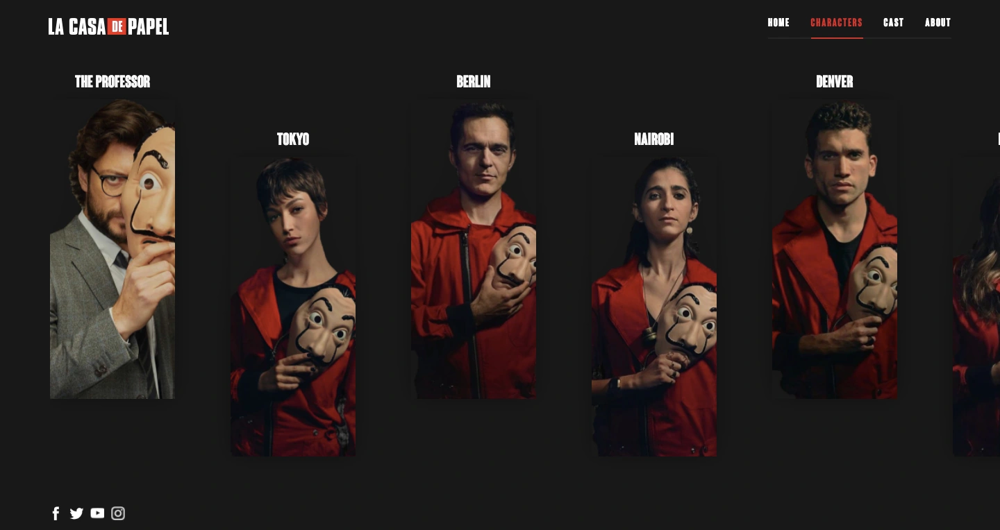

# La casa de papel

This is a website for the show 'La casa de papel'.

(The design is by Khaled Zaabalawi)

## Screenshot



## Get started

Install all modules and their dependencies that are listed on package.json file:

```bash
npm install
```

Create the public folder and start the live-server: (save one of the SCSS files afterwards to keep track of the changes correctly)

```bash
npm start
```

## Built with

- HTML
- CSS(SASS)
- JS
